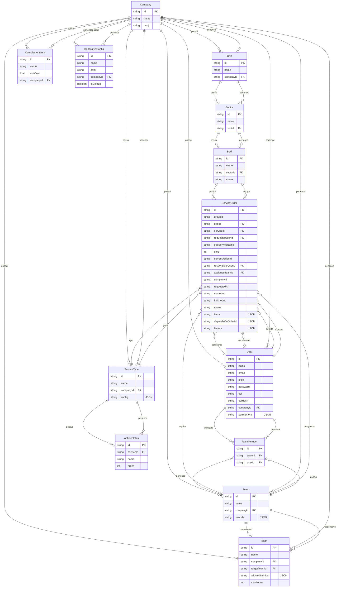

# Schema do Banco de Dados - Sistema de Gestão de Leitos

## Visão Geral

Este documento descreve a estrutura completa do banco de dados do sistema de gestão de leitos, incluindo todas as tabelas, relacionamentos e regras de negócio.

## Diagrama de Relacionamentos



## Descrição das Tabelas

### 📊 Cadastros Básicos

#### **Company** (Empresas)
Representa as organizações/empresas que utilizam o sistema.

| Campo | Tipo | Descrição |
|-------|------|-----------|
| id | String | Identificador único |
| name | String | Nome da empresa |
| cnpj | String | CNPJ da empresa |

**Relacionamentos:**
- Possui múltiplas Unidades
- Possui múltiplos Usuários
- Possui múltiplos Tipos de Serviço
- Possui múltiplas Equipes
- Possui múltiplos Insumos
- Possui múltiplas Etapas
- Possui múltiplas Configurações de Status

---

#### **Unit** (Unidades)
Unidades físicas de uma empresa (hospitais, clínicas, etc.).

| Campo | Tipo | Descrição |
|-------|------|-----------|
| id | String | Identificador único |
| name | String | Nome da unidade |
| companyId | String | FK para Company |

**Relacionamentos:**
- Pertence a uma Empresa
- Possui múltiplos Setores

---

#### **Sector** (Setores)
Setores dentro de uma unidade (UTI, Enfermaria, etc.).

| Campo | Tipo | Descrição |
|-------|------|-----------|
| id | String | Identificador único |
| name | String | Nome do setor |
| unitId | String | FK para Unit |

**Relacionamentos:**
- Pertence a uma Unidade
- Possui múltiplos Leitos

---

#### **Bed** (Leitos)
Leitos/camas dentro de um setor.

| Campo | Tipo | Descrição |
|-------|------|-----------|
| id | String | Identificador único |
| name | String | Nome/número do leito |
| sectorId | String | FK para Sector |
| status | String | Status atual (referência a BedStatusConfig ou valor padrão) |

**Relacionamentos:**
- Pertence a um Setor
- Possui múltiplas Ordens de Serviço

**Status Padrão:**
- `DISPONIVEL`
- `OCUPADO`
- `HIGIENIZACAO`
- `MANUTENCAO`
- `AGUARDANDO_ALTA`

---

### 👥 Usuários e Permissões

#### **User** (Usuários)
Usuários do sistema com suas credenciais e permissões.

| Campo | Tipo | Descrição |
|-------|------|-----------|
| id | String | Identificador único |
| name | String | Nome completo |
| email | String | E-mail |
| login | String? | Login de acesso |
| password | String? | Senha |
| cpf | String? | CPF |
| cpfHash | String? | Hash MD5 do CPF |
| companyId | String | FK para Company |
| permissions | String | JSON com permissões |

**Estrutura de Permissions (JSON):**
```json
{
  "pages": ["dashboard", "ordens", "cadastros"],
  "modules": ["bed", "service", "user"],
  "isAdmin": false
}
```

**Relacionamentos:**
- Pertence a uma Empresa
- Solicita múltiplas Ordens de Serviço (como requester)
- Executa múltiplas Ordens de Serviço (como responsável)
- Participa de múltiplas Equipes

---

#### **Team** (Equipes)
Equipes de trabalho que executam as ordens de serviço.

| Campo | Tipo | Descrição |
|-------|------|-----------|
| id | String | Identificador único |
| name | String | Nome da equipe |
| companyId | String | FK para Company |
| userIds | String | JSON array com IDs dos membros |

**Relacionamentos:**
- Pertence a uma Empresa
- É responsável por múltiplas Etapas
- É designada para múltiplas Ordens de Serviço
- Possui múltiplos Membros (TeamMember)

---

#### **TeamMember** (Membros de Equipe)
Tabela de relacionamento N:N entre usuários e equipes.

| Campo | Tipo | Descrição |
|-------|------|-----------|
| id | String | Identificador único |
| teamId | String | FK para Team |
| userId | String | FK para User |

**Relacionamentos:**
- Pertence a uma Equipe
- Pertence a um Usuário

---

### 🔧 Configurações

#### **BedStatusConfig** (Configurações de Status de Leito)
Configurações personalizáveis de status de leito por empresa.

| Campo | Tipo | Descrição |
|-------|------|-----------|
| id | String | Identificador único |
| name | String | Nome do status |
| color | String | Classe CSS ou código hex |
| companyId | String | FK para Company |
| isDefault | Boolean | Se é status padrão |

**Relacionamentos:**
- Pertence a uma Empresa

---

### 📦 Insumos e Itens

#### **ComplementItem** (Insumos/Extras)
Insumos e serviços extras que podem ser utilizados nas ordens.

| Campo | Tipo | Descrição |
|-------|------|-----------|
| id | String | Identificador único |
| name | String | Nome do insumo |
| unitCost | Float | Custo unitário |
| companyId | String | FK para Company |

**Relacionamentos:**
- Pertence a uma Empresa

---

### 🔄 Fluxos e Etapas

#### **Step** (Etapas/Ações)
Etapas independentes que podem ser usadas em fluxos de serviço.

| Campo | Tipo | Descrição |
|-------|------|-----------|
| id | String | Identificador único |
| name | String | Nome da etapa |
| companyId | String | FK para Company |
| targetTeamId | String | FK para Team responsável |
| allowedItemIds | String | JSON array com IDs de insumos permitidos |
| slaMinutes | Int? | SLA em minutos |

**Relacionamentos:**
- Pertence a uma Empresa
- É executada por uma Equipe

---

#### **ServiceType** (Tipos de Serviço/Fluxos)
Tipos de serviço que podem gerar uma ou múltiplas ordens.

| Campo | Tipo | Descrição |
|-------|------|-----------|
| id | String | Identificador único |
| name | String | Nome do serviço |
| companyId | String | FK para Company |
| config | String? | JSON com configurações |

**Estrutura de Config (JSON):**
```json
{
  "generateMultipleOS": true,
  "subOrders": [
    {
      "stepId": "step-123",
      "name": "Higienização",
      "targetTeamId": "team-456",
      "allowedItemIds": ["item-1", "item-2"],
      "bedStatusConfig": {
        "onStart": "HIGIENIZACAO",
        "onFinish": "DISPONIVEL"
      }
    }
  ]
}
```

**Relacionamentos:**
- Pertence a uma Empresa
- Possui múltiplas Ações (deprecated)
- Gera múltiplas Ordens de Serviço

---

#### **ActionStatus** (Status/Ações)
Status de ações de um serviço (mantido para compatibilidade).

| Campo | Tipo | Descrição |
|-------|------|-----------|
| id | String | Identificador único |
| serviceId | String | FK para ServiceType |
| name | String | Nome da ação |
| order | Int | Ordem de execução |

**Relacionamentos:**
- Pertence a um Tipo de Serviço

---

### 📋 Ordens de Serviço

#### **ServiceOrder** (Ordens de Serviço)
Ordens de serviço geradas a partir dos fluxos.

| Campo | Tipo | Descrição |
|-------|------|-----------|
| id | String | Identificador único |
| groupId | String | Agrupa OSs do mesmo fluxo |
| bedId | String | FK para Bed |
| serviceId | String | FK para ServiceType |
| requesterUserId | String | FK para User (solicitante) |
| subServiceName | String? | Nome da etapa/sub-serviço |
| step | Int | Índice da etapa no fluxo |
| currentActionId | String | ID da ação atual (deprecated) |
| responsibleUserId | String? | FK para User (responsável) |
| assignedTeamId | String? | FK para Team |
| companyId | String | ID da empresa |
| requestedAt | String | ISO DateTime |
| startedAt | String? | ISO DateTime |
| finishedAt | String? | ISO DateTime |
| status | String | Status atual |
| items | String | JSON com itens selecionados |
| dependsOnOrderId | String? | JSON array com IDs de dependências |
| history | String | JSON com histórico |

**Status Possíveis:**
- `BLOQUEADO` - Aguardando conclusão de dependências
- `PENDENTE` - Pronta para execução
- `EM_ANDAMENTO` - Em execução
- `CONCLUIDO` - Finalizada

**Estrutura de Items (JSON):**
```json
[
  {
    "itemId": "item-123",
    "name": "Álcool 70%",
    "quantity": 2,
    "unitCost": 15.50
  }
]
```

**Estrutura de History (JSON):**
```json
[
  {
    "status": "PENDENTE",
    "userId": "user-123",
    "timestamp": "2026-01-26T22:00:00.000Z",
    "note": "Solicitação criada"
  }
]
```

**Relacionamentos:**
- Ocupa um Leito
- É do tipo ServiceType
- Foi solicitada por um Usuário
- É executada por um Usuário (opcional)
- É designada para uma Equipe (opcional)

---

## Regras de Negócio

### Dependências entre Ordens
- Ordens podem depender de outras ordens (campo `dependsOnOrderId`)
- Uma ordem fica `BLOQUEADO` enquanto suas dependências não forem `CONCLUIDO`
- Quando uma ordem é concluída, todas as ordens que dependem dela são verificadas
- Se todas as dependências de uma ordem bloqueada foram concluídas, ela passa para `PENDENTE`

### Fluxos Sequenciais
- Quando `generateMultipleOS = true`, o serviço gera múltiplas ordens
- Cada ordem representa uma etapa do fluxo
- Por padrão, as etapas são sequenciais (etapa N depende da etapa N-1)
- É possível criar dependências customizadas entre etapas

### Status de Leito
- O status do leito pode ser alterado automaticamente quando uma ordem inicia ou finaliza
- Configurado em `ServiceType.config.subOrders[].bedStatusConfig`
- `onStart`: status aplicado quando a ordem passa para `EM_ANDAMENTO`
- `onFinish`: status aplicado quando a ordem passa para `CONCLUIDO`

### Permissões
- Usuários com `isAdmin = true` têm acesso total
- Usuários membros de equipes podem ver ordens designadas para suas equipes
- Usuários podem ver suas próprias solicitações

---

## Índices Recomendados

Para melhor performance, recomenda-se criar índices nos seguintes campos:

```sql
-- Índices para buscas frequentes
CREATE INDEX idx_units_companyId ON units(companyId);
CREATE INDEX idx_sectors_unitId ON sectors(unitId);
CREATE INDEX idx_beds_sectorId ON beds(sectorId);
CREATE INDEX idx_beds_status ON beds(status);

CREATE INDEX idx_users_companyId ON users(companyId);
CREATE INDEX idx_users_login ON users(login);
CREATE INDEX idx_users_cpfHash ON users(cpfHash);

CREATE INDEX idx_teams_companyId ON teams(companyId);
CREATE INDEX idx_team_members_teamId ON team_members(teamId);
CREATE INDEX idx_team_members_userId ON team_members(userId);

CREATE INDEX idx_steps_companyId ON steps(companyId);
CREATE INDEX idx_steps_targetTeamId ON steps(targetTeamId);

CREATE INDEX idx_services_companyId ON services(companyId);

CREATE INDEX idx_service_orders_bedId ON service_orders(bedId);
CREATE INDEX idx_service_orders_serviceId ON service_orders(serviceId);
CREATE INDEX idx_service_orders_status ON service_orders(status);
CREATE INDEX idx_service_orders_groupId ON service_orders(groupId);
CREATE INDEX idx_service_orders_requesterUserId ON service_orders(requesterUserId);
CREATE INDEX idx_service_orders_responsibleUserId ON service_orders(responsibleUserId);
CREATE INDEX idx_service_orders_assignedTeamId ON service_orders(assignedTeamId);
```

---

## Migração de Dados

### Compatibilidade com Sistema Atual
O schema foi projetado para ser compatível com o sistema SQLite atual. Os principais pontos:

1. **Campos JSON**: Mantidos como `String` para compatibilidade com SQLite
2. **IDs**: Todos os IDs são strings para flexibilidade
3. **Timestamps**: Armazenados como strings ISO 8601
4. **Relacionamentos**: Mapeados corretamente com as tabelas existentes

### Próximos Passos
1. Instalar Prisma: `npm install prisma @prisma/client`
2. Gerar cliente: `npx prisma generate`
3. Migrar dados existentes (se necessário): `npx prisma db push`
4. Validar integridade: `npx prisma validate`

---

## Observações Técnicas

- **SQLite**: O schema usa SQLite como provider, ideal para aplicações standalone
- **Cascade Delete**: Configurado para manter integridade referencial
- **Campos Opcionais**: Marcados com `?` no schema
- **JSON Fields**: Campos complexos armazenados como JSON strings
- **Timestamps**: Formato ISO 8601 para compatibilidade internacional
